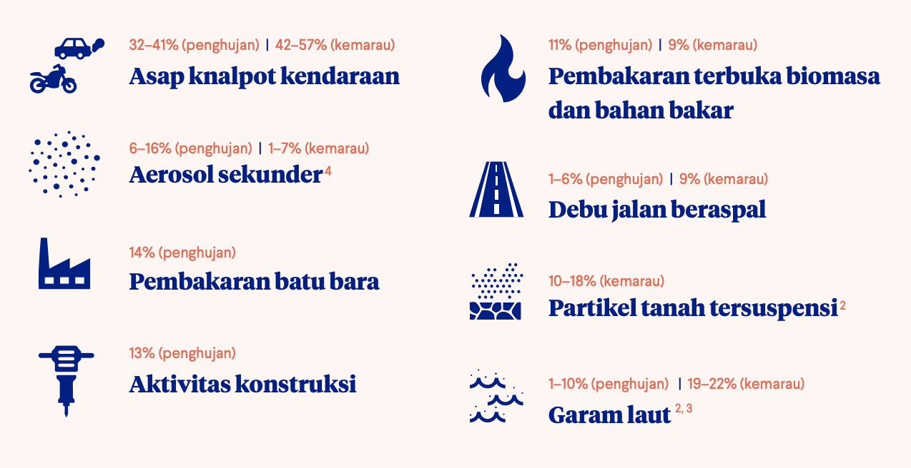

# Laporan Proyek Machine Learning Terapan - Zid Irsyadin Sartono Wijaogy

# **Weather Classification**

- **Nama:** Zid Irsyadin Sartono Wijaogy
- **Email:** zidirsyadin@gmail.com | a208yaf520@devacademy.id
- **ID Dicoding:** zid_isw

## Domain Proyek

### Latar Belakang

**Kualitas udara** adalah salah satu indikator penting yang mempengaruhi kesehatan masyarakat, lingkungan, dan kualitas hidup secara keseluruhan. Di banyak kota besar, termasuk Jakarta, polusi udara menjadi masalah yang semakin meningkat. Salah satu cara untuk mengukur kualitas udara adalah dengan menggunakan **Air Quality Index (AQI)**, yang memberikan gambaran tentang seberapa bersih atau tercemarnya udara di suatu daerah.

Jakarta, sebagai ibu kota Indonesia, mengalami masalah polusi udara yang signifikan. Kota ini memiliki tingkat polusi yang sangat tinggi, yang dapat berdampak pada kesehatan masyarakat. Menurut laporan dari **Jakarta Rendah Emisi**, kualitas udara di Jakarta telah memburuk dalam beberapa tahun terakhir, sebagian besar disebabkan oleh **kendaraan bermotor**, **industri**, dan **aktivitas pembakaran lahan** yang menyebabkan peningkatan polutan seperti **PM10**, **PM2.5**, **NO2**, **SO2**, dan **CO**. Seperti contoh hasil dari platform Jakarta Rendah Emisi:

[Image Source](https://rendahemisi.jakarta.go.id/assets/content/20211112163532_ind.jpg)

Dalam konteks ini, **Air Quality Index (AQI)** menjadi alat yang penting untuk memantau kualitas udara di Jakarta secara real-time. AQI membantu masyarakat memahami seberapa baik atau buruk kualitas udara yang mereka hirup dan dapat menjadi panduan untuk tindakan preventif, seperti menghindari kegiatan di luar ruangan ketika polusi udara berada pada tingkat yang berbahaya.

### Mengapa Masalah Ini Harus Diselesaikan?

Masalah kualitas udara di Jakarta perlu segera diselesaikan karena dampaknya yang luas terhadap kesehatan masyarakat dan kualitas hidup secara keseluruhan. Berdasarkan laporan dari **World Health Organization (WHO)**, **Polusi udara** adalah keberadaan satu atau lebih kontaminan di atmosfer, seperti debu, asap, gas, kabut, bau, dan uap, dalam jumlah dan durasi yang dapat membahayakan kesehatan manusia. Polusi udara sering kali terjadi akibat aktivitas manusia, seperti pembakaran bahan bakar fosil, industri, serta kendaraan bermotor.

Paparan terhadap polusi udara dapat terjadi melalui saluran pernapasan. Ketika kita menghirup polutan ini, hal tersebut dapat menyebabkan peradangan, stres oksidatif, imunosupresi, dan mutagenesis pada sel-sel tubuh kita. Efek ini berpengaruh pada organ-organ vital seperti paru-paru, jantung, otak, dan organ lainnya, yang akhirnya dapat menyebabkan berbagai penyakit.

#### Organ Apa Saja yang Terpengaruh oleh Polusi Udara?

Polusi udara dapat mempengaruhi hampir semua organ dalam tubuh. Beberapa polutan udara yang berukuran sangat kecil dapat menembus aliran darah melalui paru-paru dan menyebar ke seluruh tubuh, menyebabkan peradangan sistemik dan bahkan meningkatkan risiko kanker. Organ-organ yang paling terpengaruh oleh polusi udara termasuk:

- **Paru-paru**: Polusi udara dapat menyebabkan penyakit pernapasan seperti asma, bronkitis kronis, dan penyakit paru obstruktif kronik (PPOK).
- **Jantung**: Paparan jangka panjang terhadap polusi udara dapat menyebabkan peningkatan risiko penyakit jantung koroner dan stroke.
- **Otak**: Polusi udara juga dapat mempengaruhi fungsi otak, dengan bukti yang menunjukkan hubungan dengan penurunan kognitif dan gangguan neurologis.
- **Sistem reproduksi**: Beberapa penelitian juga menunjukkan bahwa polusi udara dapat berisiko terhadap kesehatan reproduksi, termasuk meningkatkan risiko kelahiran prematur dan berat badan lahir rendah.

#### Penyakit Apa Saja yang Terkait dengan Paparan Polusi Udara?

Polusi udara merupakan faktor risiko utama untuk **kematian dini** serta berbagai penyakit. Beberapa penyakit yang secara kuat terkait dengan paparan polusi udara meliputi:

1. **Stroke**
2. **Penyakit jantung iskemik**
3. **Penyakit paru obstruktif kronik (PPOK)**
4. **Kanker paru-paru**
5. **Pneumonia**
6. **Katarak** (khusus untuk polusi udara dalam rumah)

Selain itu, ada bukti yang menunjukkan hubungan polusi udara dengan peningkatan risiko **hasil kehamilan yang buruk**, seperti **berat badan lahir rendah** dan **kecil untuk usia kehamilan**, serta **penyakit diabetes**, **gangguan kognitif**, dan **penyakit neurologis**.

### Relevansi Proyek

Proyek ini bertujuan untuk membangun sistem yang dapat memprediksi dan mengklasifikasikan tingkat polusi udara di Jakarta menggunakan data **Air Quality Index (AQI)** yang mencakup berbagai polutan. Dengan menggunakan data dari berbagai stasiun pemantauan AQI di Jakarta, proyek ini bertujuan untuk memberikan informasi yang lebih cepat dan lebih akurat mengenai kondisi kualitas udara di Jakarta, yang pada gilirannya dapat membantu dalam pengambilan keputusan berbasis data untuk kebijakan lingkungan dan kesehatan masyarakat.

Di era digital ini, **teknologi** memainkan peran penting dalam mempermudah pemantauan dan pengelolaan kualitas udara. Dengan memanfaatkan teknologi dan **machine learning**, kita dapat menganalisis data kualitas udara secara real-time dan memberikan prediksi yang lebih akurat mengenai tren kualitas udara. Hal ini sangat penting karena kualitas udara yang buruk dapat memiliki dampak serius pada kesehatan manusia, seperti meningkatkan risiko penyakit pernapasan, kardiovaskular, dan bahkan kanker paru-paru. Oleh karena itu, memberikan informasi yang akurat dan mudah diakses kepada masyarakat sangat penting untuk meningkatkan kesadaran dan kewaspadaan mereka terhadap polusi udara.

Dengan sistem yang berbasis **machine learning**, kita dapat secara otomatis mengidentifikasi pola-pola dalam data yang mungkin tidak dapat dikenali dengan metode konvensional. Model-model ini dapat memprediksi perubahan kualitas udara di masa depan berdasarkan data historis, memberikan waktu bagi masyarakat dan pihak terkait untuk mengambil tindakan pencegahan. Misalnya, jika kualitas udara diprediksi akan buruk, sistem dapat memberikan peringatan kepada masyarakat untuk menghindari aktivitas luar ruangan atau menggunakan masker untuk melindungi diri mereka.

Selain itu, sistem ini dapat digunakan oleh pemerintah dan lembaga terkait untuk merumuskan kebijakan yang lebih tepat dalam mengatasi masalah polusi udara. Dengan data yang lebih akurat, pengambilan keputusan mengenai pembatasan lalu lintas, pengaturan industri, dan promosi penggunaan kendaraan ramah lingkungan dapat dilakukan dengan lebih efisien dan berdampak positif pada kualitas udara di Jakarta.

Pada akhirnya, teknologi ini tidak hanya membantu dalam **pencegahan** penyakit, tetapi juga meningkatkan **kesadaran masyarakat** akan pentingnya menjaga kualitas udara untuk kehidupan yang lebih sehat dan berkualitas. Dengan **machine learning**, kita bisa lebih proaktif dan siap menghadapi dampak buruk polusi udara di masa depan.

### Referensi

- [INDEKS STANDAR PENCEMAR UDARA (ISPU) SEBAGAI INFORMASI MUTU UDARA AMBIEN DI INDONESIA](https://ditppu.menlhk.go.id/portal/read/indeks-standar-pencemar-udara-ispu-sebagai-informasi-mutu-udara-ambien-di-indonesia)
- [Mencari Sumber Polusi di Udara melalui Source Apportionment](https://rendahemisi.jakarta.go.id/article/37/mencari-sumber-polusi-di-udara-melalui-source-apportionment)
- [Air Pollution - WHO](https://www.who.int/health-topics/air-pollution#tab=tab_1)

## Business Understanding

Pada bagian ini, saya akan menjelaskan proses klarifikasi masalah yang dihadapi, tujuan yang ingin dicapai, serta solusi yang dapat diimplementasikan untuk mencapai tujuan tersebut. Fokus utama proyek ini adalah memanfaatkan teknologi untuk memprediksi dan mengklasifikasikan tingkat polusi udara di Jakarta menggunakan data **Air Quality Index (AQI)** yang mencakup berbagai polutan.

### Problem Statements

Berikut adalah beberapa pernyataan masalah yang diangkat dalam konteks proyek ini:

- **Pernyataan Masalah 1**: Jakarta mengalami polusi udara yang sangat tinggi, yang berdampak pada kesehatan masyarakat. Kualitas udara yang buruk mengancam kesehatan pernapasan, kardiovaskular, serta menyebabkan kematian dini.
- **Pernyataan Masalah 2**: Masyarakat Jakarta tidak selalu memiliki informasi yang cepat dan akurat mengenai tingkat polusi udara, yang mengarah pada kurangnya kewaspadaan dan tindakan preventif terhadap polusi udara yang membahayakan.
- **Pernyataan Masalah 3**: Pemerintah dan lembaga terkait kesulitan dalam merumuskan kebijakan berbasis data terkait pengendalian polusi udara karena kurangnya sistem pemantauan dan prediksi yang efisien dan akurat.

### Goals

Tujuan dari pernyataan masalah di atas adalah sebagai berikut:

- **Jawaban untuk Pernyataan Masalah 1**: Membangun sistem yang dapat memprediksi tingkat polusi udara secara real-time dan mengklasifikasikan kualitas udara berdasarkan standar AQI, sehingga dapat memberikan peringatan dini untuk mengurangi dampak negatif terhadap kesehatan masyarakat.
- **Jawaban untuk Pernyataan Masalah 2**: Memberikan informasi yang cepat, akurat, dan mudah diakses kepada masyarakat mengenai kualitas udara di Jakarta, yang dapat meningkatkan kesadaran dan kewaspadaan mereka terhadap bahaya polusi udara dan mendorong tindakan preventif.
- **Jawaban untuk Pernyataan Masalah 3**: Mengembangkan sistem berbasis data yang menggunakan **machine learning** untuk memprediksi tren kualitas udara di masa depan, memberikan dukungan dalam pengambilan keputusan berbasis data untuk merumuskan kebijakan yang lebih efektif terkait pengendalian polusi udara.

### Solution Statements

Untuk mencapai tujuan yang disebutkan di atas, berikut adalah solusi yang diusulkan:

- **Solusi 1**: Menggunakan algoritma **machine learning** seperti **Random Forest**, **SVC**, dan **Gradient Boosting** untuk membangun dan memilih model prediksi kualitas udara yang akurat. Dengan menggunakan data historis dari berbagai stasiun pemantauan AQI di Jakarta, model ini dapat mengklasifikasikan tingkat polusi udara dan memberikan prediksi kualitas udara untuk beberapa hari ke depan.
- **Solusi 2**: Menerapkan **cross-validation** dan **SMOTE** untuk menangani ketidakseimbangan kelas dalam dataset. Dengan menggunakan teknik-teknik ini, model akan lebih robust dalam memprediksi polusi udara yang tinggi dan rendah, serta mampu memberikan akurasi yang lebih baik meskipun terdapat ketidakseimbangan dalam distribusi kelas.

### Evaluasi dan Metrik

Untuk memastikan bahwa solusi yang diusulkan dapat memenuhi tujuan, saya akan menggunakan **accuracy**, **F1-score**, dan **confusion matrix** sebagai metrik evaluasi. Metrik-metrik ini akan membantu dalam menilai sejauh mana model dapat memprediksi kelas kualitas udara dengan akurat dan seimbang, serta mengidentifikasi area-area yang perlu ditingkatkan.

## Data Understanding

Dataset _Air Quality Index in Jakarta 2010-2023_ yang tersedia di Kaggle, yang dipublikasikan oleh pengguna dengan nama pengguna senadu34, menyediakan data mengenai kualitas udara di Jakarta selama periode 2010 hingga 2023 (all). Dataset ini sangat berguna untuk analisis kualitas udara dan studi terkait dampaknya terhadap kesehatan serta faktor lingkungan.

Dataset ini dapat diakses melalui tautan berikut:

[Air Quality Index in Jakarta 2010-2021 – Kaggle](https://www.kaggle.com/datasets/senadu34/air-quality-index-in-jakarta-2010-2021/data?select=ispu_dki_all.csv)

### Variabel-variabel pada Dataset Air Quality Index (AQI) Jakarta adalah sebagai berikut

- **Tanggal**: Kolom ini berisi informasi tanggal pengukuran kualitas udara pada setiap entri. Tipe data untuk kolom ini adalah **object** (string), yang mencakup format tanggal seperti "2010-01-01".

- **Stasiun**: Nama stasiun pemantauan kualitas udara di Jakarta. Setiap stasiun memiliki lokasi tertentu di Jakarta yang melakukan pengukuran kualitas udara secara berkala.

- **pm10**: Mengukur konsentrasi **particulate matter** dengan diameter kurang dari 10 mikrometer di udara. Partikel ini dapat masuk ke dalam saluran pernapasan manusia dan menyebabkan gangguan pernapasan. Tipe data: **float64**.

- **pm25**: Mengukur konsentrasi **particulate matter** dengan diameter kurang dari 2.5 mikrometer. Partikel yang lebih kecil ini dapat menembus lebih dalam ke dalam paru-paru dan memengaruhi kesehatan jantung dan pernapasan. Tipe data: **float64**.

- **so2**: Mengukur konsentrasi **sulfur dioxide** di udara. Gas ini umumnya berasal dari pembakaran bahan bakar fosil dan dapat menyebabkan iritasi pada saluran pernapasan serta berkontribusi pada pembentukan hujan asam. Tipe data: **float64**.

- **co**: Mengukur konsentrasi **carbon monoxide** di udara. Gas ini berbahaya karena menghalangi pengangkutan oksigen dalam tubuh dan dapat menyebabkan kerusakan pada sistem pernapasan serta gangguan jantung. Tipe data: **float64**.

- **o3**: Mengukur konsentrasi **ozone** di permukaan tanah. Ozone di atmosfer atas sangat penting untuk menyaring radiasi ultraviolet, tetapi ketika berada di permukaan tanah, ozone dapat menyebabkan gangguan pernapasan dan masalah kesehatan lainnya. Tipe data: **float64**.

- **no2**: Mengukur konsentrasi **nitrogen dioxide**. Gas ini dihasilkan dari pembakaran bahan bakar fosil, terutama oleh kendaraan dan industri, dan dapat menyebabkan gangguan pernapasan serta meningkatkan risiko penyakit jantung. Tipe data: **float64**.

- **max**: Kolom ini menunjukkan nilai **AQI maksimum** pada hari tertentu yang mewakili kualitas udara tertinggi yang terdeteksi pada tanggal tersebut. Kolom ini adalah nilai numerik yang mencerminkan tingkat pencemaran udara pada hari tersebut. Tipe data: **float64**.

- **Critical**: Kolom ini berisi konsentrasi polutan udara yang paling tinggi pada setiap entri. Ini menunjukkan polutan mana yang menjadi penyebab utama buruknya kualitas udara pada saat itu. Tipe data: **object**.

- **Category**: Kolom ini menunjukkan kategori kualitas udara berdasarkan AQI, dengan kategori seperti "Baik", "Sedang", "Tidak Sehat", "Sangat Tidak Sehat", "Berbahaya", dan "Tidak Ada Data". Tipe data: **object**.

### Insight dari Data Exploration (EDA)

Dalam tahap **Data Understanding**, berikut adalah beberapa insight yang diperoleh:

1. **Pengecekan Missing Values**:

   - Kolom **pm25** memiliki jumlah **missing values** yang sangat tinggi (3903 data hilang), yang menunjukkan bahwa pengukuran untuk polutan ini jarang tersedia.
   - Kolom **pm10** memiliki 160 missing values, sedangkan kolom **so2**, **co**, **no2**, dan **o3** masing-masing memiliki sedikit missing values, yang menunjukkan bahwa beberapa pengukuran polutan tidak tercatat di beberapa stasiun atau pada beberapa tanggal.
   - Kolom **Critical** hanya memiliki satu missing value, yang dapat diatasi dengan imputasi atau penghapusan baris tersebut.

2. **Pengecekan Duplikat**:

   - Dataset ini tidak memiliki duplikat, yang memastikan bahwa setiap entri dalam dataset adalah unik dan tidak ada data yang terulang.

3. **Pengecekan Outliers**:

   - Berdasarkan **boxplot** yang dihasilkan, terlihat adanya beberapa **outliers** pada kolom polutan seperti **pm10**, **pm25**, **so2**, **o3**, dan **no2**, yang menunjukkan adanya pengukuran dengan nilai sangat tinggi. Pengukuran tersebut perlu dipertimbangkan apakah perlu dibersihkan atau disesuaikan.

4. **Distribusi Data**:

   - **Jumlah Data per Stasiun**: Stasiun **DKI4 (Lubang Buaya)** memiliki jumlah data yang paling banyak, hampir mencapai 1600 entri, sementara stasiun **DKI1 (Bundaran HI)** memiliki jumlah data yang jauh lebih sedikit. Hal ini dapat menunjukkan bahwa beberapa stasiun lebih sering melakukan pengukuran, yang berpotensi menyebabkan ketidakseimbangan dalam distribusi data antara stasiun-stasiun.
   - **Distribusi AQI**: Sebagian besar data terdistribusi dalam kategori **AQI Sedang**, yang menunjukkan kualitas udara yang tidak terlalu buruk atau terlalu baik. Sedangkan kategori **AQI Baik** dan **Tidak Sehat** ditemukan dalam jumlah yang lebih sedikit.

5. **Visualisasi Tren AQI per Tahun**:
   - Grafik tren AQI menunjukkan fluktuasi yang signifikan antara tahun 2010 hingga 2022. Terlihat bahwa pada tahun 2022, beberapa stasiun menunjukkan penurunan yang signifikan pada nilai AQI dibandingkan tahun-tahun sebelumnya. Hal ini bisa disebabkan oleh pembatasan aktivitas selama pandemi COVID-19, yang mengurangi polusi dari sektor transportasi dan industri.

### Langkah Selanjutnya

Berdasarkan insight ini, langkah-langkah yang perlu dilakukan selanjutnya adalah:

- **Mengatasi Missing Values**: Mengimputasi missing values kolom lainnya yang memiliki missing values menggunakan teknik yang sesuai, kecuali kolom **"pm2.5"** karena memiliki nilai missing hingga 90%. Selain itu kolom **tanggal** juga akan dihapus agar membuat fitur yang digunakan untuk klasifikasi menjadi lebih valid.
- **Mengatasi Outliers**: Mempertimbangkan penghapusan atau penyesuaian nilai outliers pada kolom polutan, terutama yang sangat ekstrem.
- **Normalisasi atau Scaling**: Melakukan normalisasi atau scaling pada fitur numerik agar model machine learning dapat berfungsi dengan lebih baik.
- **Melakukan Label Encoder**: untuk mengubah nilai kategorikal menjadi numerikal agar memudahkan dalam proses training.
- **Menghapus Kelas yang Tidak Memiliki Sampel**: Menghapus kelas **"Tidak Ada Data"** dan **"Berbahaya"** agar model dapat berfokus pada data yang lebih representatif.

Dengan memahami data lebih mendalam, kita dapat membuat keputusan yang lebih tepat terkait pemrosesan data sebelum membangun model prediksi.

## Data Preparation

Pada bagian ini, saya menerapkan beberapa teknik **data preparation** untuk memastikan bahwa dataset siap digunakan dalam tahap **modeling**. Berikut adalah langkah-langkah yang dilakukan dalam **data preparation**:

1. **Menghapus Kolom yang Tidak Relevan**:

   - **Tanggal**: Kolom ini dihapus karena tidak memberikan informasi yang relevan untuk model. Meskipun tanggal dapat menunjukkan waktu pengukuran, fitur ini tidak memberikan hubungan langsung dengan prediksi kualitas udara.
   - **Tahun**: Kolom **tahun** dihapus karena merupakan hasil ekspansi dari kolom **tanggal**. Kolom ini tidak memberikan informasi tambahan yang signifikan karena tahun dapat diambil langsung dari **tanggal**.
   - **pm2.5**: Kolom **pm2.5** dihapus karena memiliki **missing value** yang sangat tinggi (90%), yang dapat memengaruhi kualitas data secara keseluruhan. Mengingat jumlah data hilang yang besar, kolom ini tidak dapat diandalkan untuk analisis lebih lanjut.

2. **Handling Missing Values**:

   - Setelah menghapus kolom yang tidak relevan, saya melanjutkan dengan mengatasi **missing values** pada kolom-kolom yang memiliki nilai hilang. Kolom seperti **so2**, **co**, **o3**, dan **no2** diisi dengan **mean** untuk nilai numerik dan **modus** untuk kolom kategorikal seperti **critical**. Dengan cara ini, dataset tidak lagi memiliki missing values dan siap untuk analisis.

3. **Class Adjusting**:

   - Saya memutuskan untuk menghapus kelas Berbahaya dan Tidak Ada Data, karena hanya berisi satu sampel dan akan mengganggu sistem secara signifikan nantinya.

4. **Label Encoding untuk Kolom Kategorikal**:

   - Kolom **critical** dan **stasiun**, yang merupakan kolom kategorikal, diubah menjadi numerik menggunakan **LabelEncoder**.
     - Kolom **critical** menggambarkan tingkat keparahan kualitas udara yang dapat berupa kategori seperti **BAIK**, **SEDANG**, dan **TIDAK SEHAT**.
     - Kolom **stasiun** berisi nama stasiun pemantauan yang melakukan pengukuran kualitas udara di berbagai lokasi Jakarta.
   - Dengan mengubah kolom ini menjadi numerik, model **machine learning** dapat memprosesnya dengan lebih mudah.

5. **Scaling (Normalisasi)**:

   - Semua fitur numerik, seperti **pm10**, **so2**, **co**, **o3**, **no2**, dan **max**, distandarisasi menggunakan **StandardScaler**. Proses ini menstandarisasi data sehingga fitur-fitur tersebut memiliki **mean = 0** dan **std = 1**, yang sangat penting agar model **machine learning** dapat berfungsi dengan baik tanpa terpengaruh oleh perbedaan skala antar fitur.

6. **Descriptive Statistics**:

   - Setelah tahapan data preparation, statistik deskriptif untuk kolom numerik menunjukkan bahwa **mean** untuk kolom seperti **pm10** adalah 0.005 dengan **std = 0.974**, sementara **co** memiliki **mean = 0.015** dengan **std = 0.993**. Kolom **critical** menunjukkan bahwa sebagian besar nilai adalah **1** (tidak kritis), dan kolom **category** terdistribusi antara kategori **2** dan **4** yang menggambarkan status kualitas udara dari **baik** hingga **sangat tidak sehat**.

7. **Data Distribution**:

   - Setelah tahapan data preparation, distribusi data untuk setiap polutan menjadi lebih merata. Kolom seperti **pm25** dan **so2**, yang sebelumnya memiliki banyak **missing values**, kini telah terisi dengan data yang lebih representatif. Secara keseluruhan, distribusi **AQI** menunjukkan lebih banyak data dengan status **"Sedang"**, yang mencerminkan kualitas udara Jakarta yang sebagian besar berada dalam kategori ini.

8. **Jumlah Data**:
   - Dataset kini memiliki 4624 entri yang tersisa setelah mengatasi missing values. Proses ini mengurangi jumlah data yang hilang secara signifikan, menggantinya dengan metode imputasi yang memungkinkan analisis dan modeling yang lebih akurat.

### Alasan Mengapa Tahapan Data Preparation Diperlukan

Tahapan **data preparation** sangat penting untuk memastikan bahwa dataset yang digunakan dalam **modeling** tidak terdistorsi oleh **missing values** atau **outliers**. Dengan menghapus kolom yang tidak relevan, seperti **tanggal**, **tahun**, dan **pm2.5**, saya mengurangi kompleksitas data yang tidak memberikan kontribusi berarti bagi model. Selain itu, dengan melakukan **scaling** pada fitur numerik, saya memastikan bahwa semua fitur berada pada skala yang sama, yang memungkinkan model **machine learning** untuk bekerja lebih efektif. Proses-proses ini memastikan bahwa dataset yang digunakan untuk membangun model prediksi kualitas udara Jakarta adalah **bersih**, **terstandarisasi**, dan **siap untuk dianalisis**.

## Modeling

Pada bagian ini, saya membahas mengenai model **machine learning** yang digunakan untuk memprediksi kualitas udara Jakarta berdasarkan data **Air Quality Index (AQI)**. Beberapa algoritma klasifikasi diterapkan untuk mengevaluasi model, dan **Random Forest** dipilih sebagai model terbaik untuk proyek ini. Berikut adalah penjelasan mengenai algoritma yang digunakan, serta proses pelatihan dan evaluasi yang diterapkan pada masing-masing model.

### 1. **Random Forest Classifier**

- **Random Forest** adalah algoritma **ensemble learning** yang menggabungkan beberapa **decision trees** untuk meningkatkan akurasi dan mengurangi overfitting.
- Setiap **decision tree** dalam Random Forest dilatih menggunakan subset acak dari data dan fitur. Prediksi akhir dilakukan dengan **voting** mayoritas hasil dari pohon-pohon keputusan tersebut.

**Cara Kerja**:

- **Bagging (Bootstrap Aggregating)** digunakan untuk membangun beberapa pohon keputusan dengan mengambil sampel acak dari data (dengan pengembalian).
- Setiap pohon membuat prediksi, dan prediksi akhir ditentukan dengan **voting** mayoritas untuk klasifikasi.

**Kelebihan**:

- **Robust terhadap overfitting**: Random Forest dapat mengatasi overfitting dengan baik, terutama pada data yang lebih besar dan kompleks.
- **Mudah digunakan**: Tidak membutuhkan banyak tuning parameter dan dapat bekerja dengan baik dengan default settings.
- **Dapat menangani data numerik dan kategorikal**: Random Forest dapat bekerja dengan baik dengan berbagai jenis data.

**Kekurangan**:

- **Kompleksitas tinggi**: Modelnya bisa sangat besar dan lambat untuk diinterpretasikan jika pohon keputusan sangat banyak.
- **Waktu komputasi lebih lama**: Untuk dataset yang sangat besar, training model bisa memakan waktu lebih lama dibandingkan algoritma lain yang lebih sederhana.

### 2. **Support Vector Classifier (SVC)**

- **Support Vector Classifier (SVC)** adalah algoritma klasifikasi berbasis **Support Vector Machine (SVM)** yang berfokus pada mencari **hyperplane terbaik** yang memisahkan kelas-kelas dengan margin yang paling lebar.
- SVC mencoba memaksimalkan margin antara dua kelas dengan memilih titik data yang paling dekat dengan hyperplane sebagai **support vectors**.

**Cara Kerja**:

- SVC memetakan data ke ruang fitur yang lebih tinggi jika perlu, menggunakan kernel trick untuk menangani data non-linear.
- Algoritma ini berusaha menemukan **hyperplane** yang memaksimalkan margin antara dua kelas.

**Kelebihan**:

- **Kinerja tinggi pada data non-linear**: SVC sangat efektif dalam menangani data non-linear dengan menggunakan kernel trick.
- **Peningkatan akurasi**: Dapat memberikan hasil yang sangat baik, terutama pada dataset yang kompleks.
- **Dapat menangani data dengan dimensi tinggi**: SVC bekerja dengan baik pada dataset dengan banyak fitur.

**Kekurangan**:

- **Pemilihan kernel yang tepat**: Memilih kernel yang tepat bisa menjadi tantangan. Kernel yang salah dapat mengurangi kinerja model.
- **Waktu komputasi lama**: SVC cenderung lebih lambat pada dataset yang sangat besar atau dengan banyak fitur.
- **Kurang efisien untuk dataset besar**: Memerlukan banyak waktu untuk memproses dataset yang sangat besar.

### 3. **Gradient Boosting Classifier**

- **Gradient Boosting** adalah algoritma ensemble learning yang menggabungkan beberapa model **weak learners** (biasanya pohon keputusan kecil) dengan tujuan meningkatkan akurasi prediksi.
- Algoritma ini bekerja dengan membangun pohon keputusan secara berurutan, di mana setiap pohon baru mengoreksi kesalahan yang dilakukan oleh pohon sebelumnya.

**Cara Kerja**:

- Pada setiap iterasi, **model baru** dibangun untuk mengurangi **error residual** dari model sebelumnya.
- Proses ini mengoptimalkan **loss function** dengan cara menggunakan gradien untuk memperbaiki kesalahan secara bertahap.
- **Learning rate** dan jumlah pohon (estimators) adalah parameter penting dalam mengontrol kompleksitas model.

**Kelebihan**:

- **Akurat**: Gradient Boosting sering memberikan hasil yang sangat baik dan lebih akurat dibandingkan dengan model lain, terutama dalam kompetisi data science.
- **Dapat menangani data kompleks**: Berfungsi dengan baik untuk data dengan hubungan non-linear dan fitur yang sangat banyak.
- **Fleksibel**: Dapat digunakan dengan berbagai jenis model dasar (misalnya pohon keputusan, regresi, dll.).

**Kekurangan**:

- **Overfitting**: Jika tidak dikontrol dengan baik, Gradient Boosting dapat mengalami overfitting, terutama dengan data yang berisik atau terlalu banyak pohon.
- **Waktu komputasi**: Algoritma ini lebih lambat dibandingkan dengan algoritma lain seperti Random Forest karena model dibangun secara berurutan.
- **Memerlukan tuning**: Performa algoritma sangat bergantung pada pemilihan hyperparameter (seperti jumlah pohon dan learning rate), yang memerlukan tuning yang hati-hati.

---

### Proses Pelatihan dengan **Cross-Validation** dan **SMOTE**

Selama proses **training**, saya menggunakan dua teknik utama untuk meningkatkan kualitas model:

1. **Cross-Validation**:

   - saya menggunakan **Stratified K-Fold Cross-Validation** dengan **n_splits=5** untuk mengevaluasi model. Teknik ini membagi data menjadi lima bagian, melatih model pada empat bagian, dan mengujinya pada satu bagian. Proses ini dilakukan lima kali untuk memastikan model tidak terpengaruh oleh pembagian data yang spesifik.
   - Cross-validation membantu meminimalkan **overfitting** dan memberikan gambaran yang lebih jelas tentang seberapa baik model dapat menggeneralisasi pada data yang tidak terlihat.

2. **SMOTE (Synthetic Minority Over-sampling Technique)**:
   - Untuk mengatasi **ketidakseimbangan kelas** dalam dataset, saya menggunakan **SMOTE** untuk menghasilkan sampel sintetis dari kelas yang kurang terwakili (misalnya, kategori AQI "Tidak Sehat"). Teknik ini membantu memastikan bahwa model dilatih pada data yang lebih seimbang dan dapat meningkatkan akurasi prediksi untuk kelas minoritas.

### Model yang Dipilih: **Random Forest**

Berdasarkan hasil evaluasi dan kinerja model selama pelatihan, **Random Forest** dipilih sebagai model terbaik untuk prediksi kualitas udara Jakarta. **Random Forest** memberikan akurasi yang sangat baik dan sangat robust terhadap **overfitting**. Selain itu, model ini memberikan hasil yang konsisten dengan waktu eksekusi yang lebih cepat pada data testing dibandingkan algoritma lain, seperti **SVC** yang memerlukan waktu komputasi lebih lama pada dataset besar.

---

### Kesimpulan

Tiga algoritma yang digunakan — **Random Forest**, **SVC**, dan **Gradient Boosting**, masing-masing memiliki keunggulan dan kelemahan yang berbeda:

- **Random Forest** lebih mudah digunakan dan robust terhadap overfitting, cocok untuk dataset besar dan kompleks.
- **SVC** bekerja sangat baik pada dataset non-linear dengan margin yang jelas antara kelas, tetapi lebih lambat pada dataset besar.
- **Gradient Boosting** sangat akurat dan fleksibel, tetapi memerlukan tuning parameter yang cermat dan dapat lebih lambat pada data besar.

Setelah melalui evaluasi model dan analisis lebih lanjut, **Random Forest** dipilih sebagai model terbaik karena kinerjanya yang superior dalam hal akurasi, kecepatan, dan kemampuan untuk mengatasi kompleksitas dataset.

## Evaluation

Pada bagian ini, saya menjelaskan metrik evaluasi yang digunakan untuk mengevaluasi kinerja model klasifikasi dalam memprediksi kualitas udara Jakarta. saya menggunakan metrik **akurasi**, **precision**, **recall**, dan **F1-score** untuk menilai performa model dalam klasifikasi **AQI**.

### Metrik Evaluasi yang Digunakan

1. **Akurasi (Accuracy)**:

   - **Akurasi** mengukur seberapa banyak prediksi yang benar dibandingkan dengan total prediksi. Metrik ini sangat berguna untuk mengukur kinerja model secara umum pada masalah klasifikasi.
   - **Formula**:  
     \[
     \text{Akurasi} = \frac{\text{Jumlah prediksi benar}}{\text{Jumlah total prediksi}}
     \]

2. **Precision**:

   - **Precision** mengukur ketepatan prediksi model dalam mengklasifikasikan kelas positif. Precision yang tinggi menunjukkan bahwa sebagian besar prediksi positif model benar.
   - **Formula**:  
     \[
     \text{Precision} = \frac{\text{True Positives}}{\text{True Positives + False Positives}}
     \]

3. **Recall**:

   - **Recall** mengukur kemampuan model dalam mendeteksi semua contoh kelas positif dalam dataset. Recall yang tinggi berarti model berhasil mengidentifikasi sebagian besar contoh positif.
   - **Formula**:  
     \[
     \text{Recall} = \frac{\text{True Positives}}{\text{True Positives + False Negatives}}
     \]

4. **F1-Score**:
   - **F1-Score** adalah **harmonic mean** dari precision dan recall, memberikan gambaran keseimbangan antara keduanya. Metrik ini digunakan ketika Anda ingin menyeimbangkan precision dan recall.
   - **Formula**:  
     \[
     \text{F1-Score} = 2 \times \frac{\text{Precision} \times \text{Recall}}{\text{Precision} + \text{Recall}}
     \]

### Hasil Evaluasi Berdasarkan Metrik

Setelah melakukan evaluasi terhadap tiga algoritma klasifikasi — **Random Forest**, **SVC**, dan **Gradient Boosting** — berikut adalah hasil yang diperoleh berdasarkan metrik evaluasi yang digunakan:

---

#### 1. **Random Forest**

- **Training**:

  - **Cross-Val Accuracy**: 1.0000
  - **Cross-Val F1-Score**: 1.0000
  - **Classification Report**:
    - **Precision**: 1.00 untuk semua kelas (Baik, Sangat Tidak Sehat, Sedang, Tidak Sehat).
    - **Recall**: 1.00 untuk semua kelas, menunjukkan bahwa model berhasil mengidentifikasi seluruh contoh untuk setiap kelas.
    - **F1-Score**: 1.00 untuk semua kelas, menunjukkan keseimbangan yang sangat baik antara precision dan recall.
  - **Execution Time** (Training): 8.1675 seconds

- **Testing**:
  - **Execution Time** (Testing): 0.0246 seconds
  - **Classification Report**:
    - **Precision**: 1.00 untuk semua kelas.
    - **Recall**: 1.00 untuk semua kelas.
    - **F1-Score**: 1.00 untuk semua kelas.
  - **Insight**: **Random Forest** menunjukkan **kinerja sempurna** pada **data training** dan **data testing** dengan waktu eksekusi yang sangat cepat pada data testing (0.0246 detik).

---

#### 2. **Support Vector Classifier(SVC)**

- **Training**:

  - **Cross-Val Accuracy**: 0.9714
  - **Cross-Val F1-Score**: 0.9713
  - **Classification Report**:
    - **Precision**: 0.95 untuk **Baik**, 0.98 untuk **Sangat Tidak Sehat**, dan 0.99 untuk **Sedang** dan **Tidak Sehat**.
    - **Recall**: 1.00 untuk **Baik** dan **Sangat Tidak Sehat**, 0.93 untuk **Sedang**, dan 0.98 untuk **Tidak Sehat**.
    - **F1-Score**: 0.97 untuk **Baik**, 0.99 untuk **Sangat Tidak Sehat**, 0.96 untuk **Sedang**, dan 0.98 untuk **Tidak Sehat**.
  - **Execution Time** (Training): 25.5922 seconds

- **Testing**:
  - **Execution Time** (Testing): 0.5240 seconds
  - **Classification Report**:
    - **Precision**: 0.6458 untuk **Baik**, 0.9348 untuk **Sangat Tidak Sehat**, 0.9979 untuk **Sedang**, dan 0.9744 untuk **Tidak Sehat**.
    - **Recall**: 1.00 untuk **Baik**, 1.00 untuk **Sangat Tidak Sehat**, 0.9178 untuk **Sedang**, dan 0.9871 untuk **Tidak Sehat**.
    - **F1-Score**: 0.7848 untuk **Baik**, 0.9663 untuk **Sangat Tidak Sehat**, 0.9562 untuk **Sedang**, dan 0.9807 untuk **Tidak Sehat**.
  - **Insight**: **SVC** menunjukkan performa yang sangat baik, namun sedikit lebih lambat dalam waktu eksekusi pada **data testing** dibandingkan dengan **Random Forest**. Precision dan recall untuk **Sangat Tidak Sehat** dan **Tidak Sehat** sangat baik.

---

#### 3. **Gradient Boosting**

- **Training**:

  - **Cross-Val Accuracy**: 1.0000
  - **Cross-Val F1-Score**: 1.0000
  - **Classification Report**:
    - **Precision**: 1.00 untuk semua kelas (Baik, Sangat Tidak Sehat, Sedang, Tidak Sehat).
    - **Recall**: 1.00 untuk semua kelas.
    - **F1-Score**: 1.00 untuk semua kelas.
  - **Execution Time** (Training): 43.8336 seconds

- **Testing**:
  - **Execution Time** (Testing): 0.0040 seconds
  - **Classification Report**:
    - **Precision**: 1.00 untuk semua kelas.
    - **Recall**: 1.00 untuk semua kelas.
    - **F1-Score**: 1.00 untuk semua kelas.
  - **Insight**: **Gradient Boosting** juga menunjukkan **akurasi sempurna** pada **data testing** dan **data training**. Meskipun waktu eksekusinya lebih lama pada **data training**, waktu testing sangat cepat (0.0040 detik).

---

### **Summary**

| Model                 | Training Accuracy | Training F1-Score | Testing Accuracy | Testing F1-Score | Training Time (s) | Testing Time (s) |
| --------------------- | ----------------- | ----------------- | ---------------- | ---------------- | ----------------- | ---------------- |
| **Random Forest**     | 1.0000            | 1.0000            | 1.0000           | 1.0000           | 8.1675            | 0.0246           |
| **SVC**               | 0.9714            | 0.9713            | 0.9503           | 0.9503           | 25.5922           | 0.5240           |
| **Gradient Boosting** | 1.0000            | 1.0000            | 1.0000           | 1.0000           | 43.8336           | 0.0040           |

### **Kesimpulan**:

- **Random Forest** dan **Gradient Boosting** menunjukkan kinerja yang sangat baik pada **data training** dan **data testing**, dengan **akurasi sempurna** pada kedua set data. **Random Forest** memiliki waktu eksekusi yang lebih cepat pada data testing, sementara **Gradient Boosting** menunjukkan waktu eksekusi lebih cepat pada data testing meskipun lebih lambat saat pelatihan.
- **SVC** memiliki sedikit penurunan kinerja dengan **akurasi** dan **f1-score** yang sedikit lebih rendah pada data testing, tetapi masih memberikan hasil yang sangat baik. Waktu eksekusi untuk **SVC** lebih lama pada data testing dibandingkan dengan **Random Forest** dan **Gradient Boosting**.

Berdasarkan hasil ini, **Random Forest** dipilih sebagai model terbaik karena kinerjanya yang superior dalam hal **akurasi**, **kecepatan**, dan kemampuannya untuk mengatasi kompleksitas dataset dengan lebih baik.

**---Ini adalah bagian akhir laporan---**
